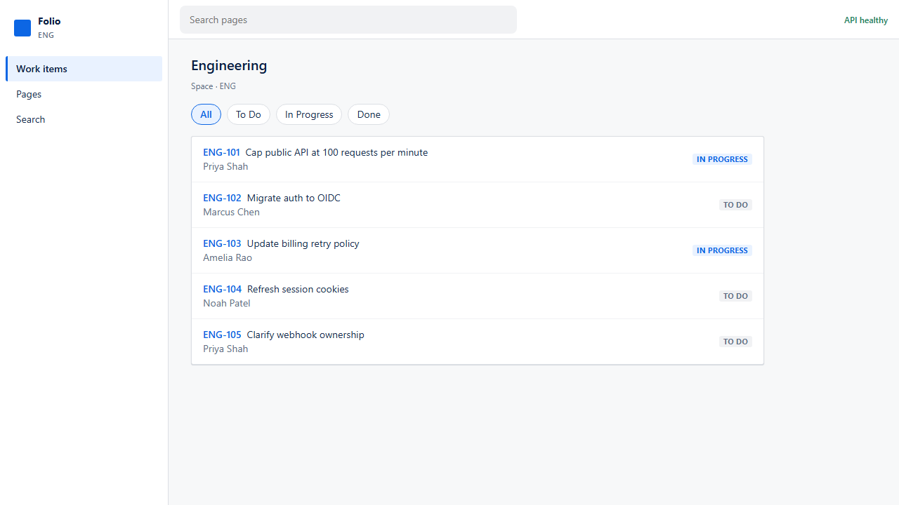
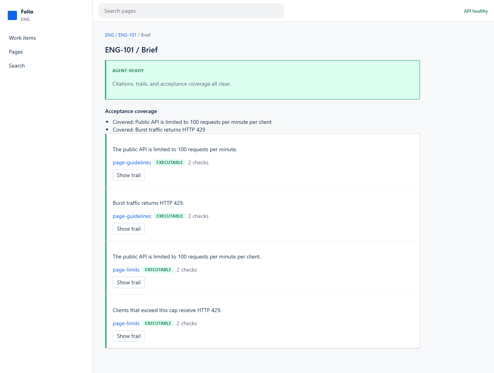
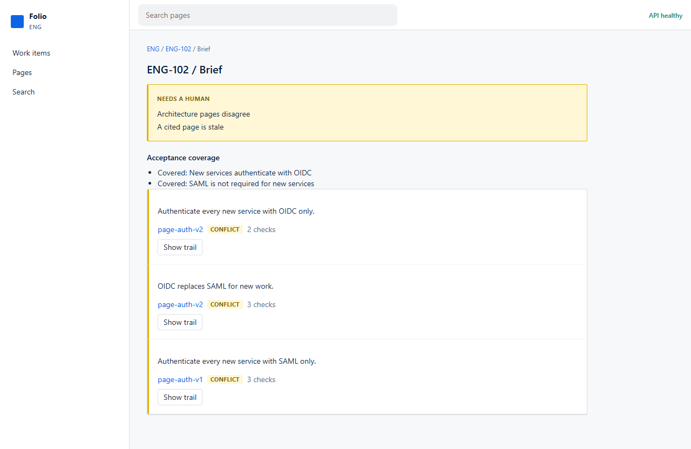
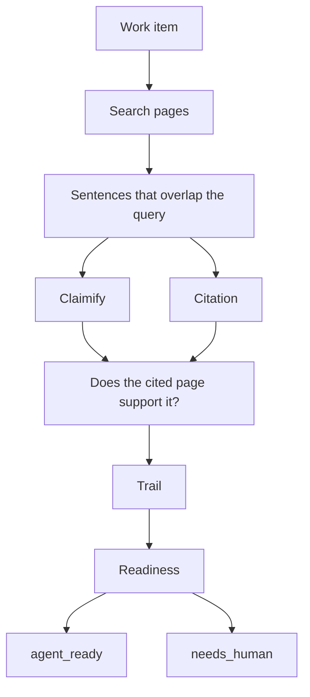

# Evalio

Open a work item, generate a brief, and see whether it is safe to hand to an agent.

Rovo already searches and cites across the [Teamwork Graph](https://www.atlassian.com/platform/teamwork-graph). [Jira Planner](https://www.atlassian.com/blog/jira/introducing-jira-planner) turns an idea into a spec, then into work items, and can say whether that spec is detailed enough to execute. Evalio is a small sketch of the step after that: a computed brief with a trail, and a UI that can refuse when sources conflict, go stale, or cite the wrong page.

The brief is computed on each request. Nothing is stored.

## Try it

Live UI: [swaggyxo.github.io/evalio](https://swaggyxo.github.io/evalio/) (runs in the browser)

Live API: [evalio-api-edienbcrga-el.a.run.app](https://evalio-api-edienbcrga-el.a.run.app/) — `pnpm cloud:down` removes it.

Or locally:

```bash
pnpm install
pnpm dev
```

- UI: http://127.0.0.1:5173
- API: http://127.0.0.1:3001

Click these in order. Seeded data. No setup.

1. **Hand it over** — [ENG-101 brief](https://swaggyxo.github.io/evalio/items/ENG-101/brief). Green **Agent-ready**. Open **Show trail** to see retrieve → extract → assemble.
2. **Refuse** — [ENG-102 brief](https://swaggyxo.github.io/evalio/items/ENG-102/brief). Yellow **Needs a human**. Architecture pages disagree (OIDC vs SAML).
3. **Wrong citation** — [ENG-103 brief](https://swaggyxo.github.io/evalio/items/ENG-103/brief). A claim is **Wrong source**.

Optional: ENG-104 stale session policy. ENG-105 unresolved “they”.







## Where this sits

These are the public Atlassian pieces Evalio is reacting to:

- [Rovo](https://www.atlassian.com/software/rovo) — search, chat, and agents over connected work
- [Teamwork Graph](https://www.atlassian.com/platform/teamwork-graph) — the map those agents read
- [Introducing Jira Planner](https://www.atlassian.com/blog/jira/introducing-jira-planner) — idea → spec → work items; flags underspecified plans
- [AI that knows your business](https://www.atlassian.com/blog/company-news/closing-the-ai-context-gap) — the context layer behind that

Evalio is not a knowledge graph and not a spec generator. Those assemble a plan. This is a readiness check on a seeded catalog.

What the gate actually looks at:

- claims have to be verifiable (opinions and dangling pronouns stay **Needs a human**)
- the cited page has to be the page that actually supports the sentence
- retrieve → extract → assemble is a trail you can open
- this work item’s acceptance lines have to be covered
- contradicting pages are not merged
- stale pages are flagged

## How the brief is computed



Local `pnpm dev` talks to Express. GitHub Pages runs the same catalog, search, and verify packages in the browser, so the UI stays up if the API is taken down.

```bash
pnpm check
pnpm --filter @evalio/e2e exec playwright install chromium
pnpm --filter @evalio/e2e exec playwright test
```

## Cloud Run

The live API is one service in `asia-south1`, same region as the rest of this GCP project:

- max 1 instance, scale to zero
- 512Mi, 15s timeout, 10 in-flight requests
- GET only, 8kb body cap, 40 req/min and 200 req/hour per IP
- CORS locked to GitHub Pages and local Vite

```bash
pnpm cloud:up
pnpm cloud:down
```

Opening the API URL in a browser shows GitHub and LinkedIn. `cloud:down` deletes this service only. Optional: `EVALIO_WIRE_PAGES=1 pnpm cloud:up` points Pages at Cloud Run; skip that unless you want the UI to depend on it.

`.evalio-cloud.json` is local state, gitignored.

## Layout

- `apps/web` — React, PostCSS, ADS tokens
- `apps/api` — Express REST
- `packages/domain` — types, seed catalog, Result errors
- `packages/search` — inverted index, BM25
- `packages/verify` — claims, trails, attribution, conflicts, rubric
